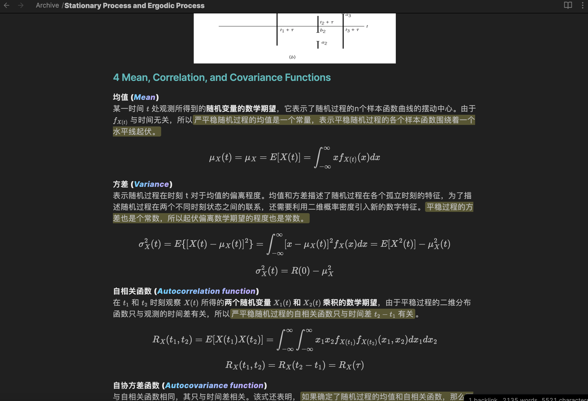

# Awesome SEU 东南大学

留给学弟学妹们的资源，笔者是 6 系的，但是很多资料都是通用的，也欢迎不同院系/本院系的其他同学提供多样的资源并 Pull Requests。

如果你想获得/添加/修改内容，可以提交 Pull requests 或使用 Issues，也可以[直接联系我](mailto:preminstrel@gmail.com)。希望本 Repo 可以帮助到更多的人！

- 资料格式建议使用 PDF 格式，docx/ppt 请转为 PDF 格式

## 网络环境
一些同学反应，由于一些不可抗力因素，国内访问GitHub或者下载本repo的文件会有些困难。如果不会翻墙/用VPN，这里推荐一个小工具：[FastGitHub](https://github.com/dotnetcore/FastGithub)，我这里提供百度云盘的下载链接（Windows版本）：
> 链接: https://pan.baidu.com/s/1eF5c01A_6CxRsa5lx0SYlQ?pwd=6gj6 提取码: 6gj6

## TODO
由于笔者最近比较忙，一些课堂笔记来不及整理发出来，这里**希望有一个学弟/学妹联系我能帮助将笔记整理发出**（我提供笔记，只要负责整理发出就行），个人感觉很多笔记还是挺不错的。可以直接联系我，或者打开一个 Issue 来联系我。

笔记示例截图：

## 贡献/参与者

